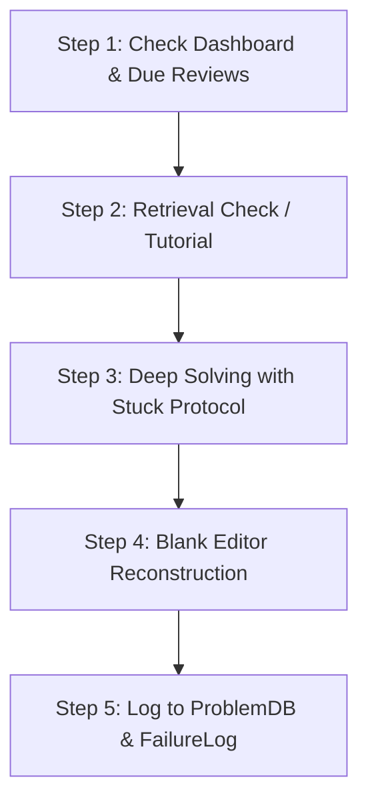

# 📘 Complete Specialist Guide: DSA & AI-Infrastructure Training System

> **Workbook File:** `DSA_AI_Infra_Training.xlsx`  
> **Generator Script:** `dsa_builder.py`  
> **Curriculum Scope:** 168 Days / 24 Weeks (~5.5 Months)  
> **Target Roles:** Tier-1 Systems, High-Performance Computing, and AI-Infrastructure Engineers (Anthropic, OpenAI, Google DeepMind, Meta Infra, NVIDIA, Databricks, CoreWeave)

---

## 🎯 Executive Summary & The "Specialist" Standard

This training system is built for engineers who refuse to settle for generic LeetCode memorization. In Tier-1 AI Infrastructure and Systems interviews, knowing how to reverse a linked list or write a basic DFS is table stakes. 

A **true Specialist** must possess two distinct layers of mastery:
1. **Algorithmic Automaticity:** The ability to decompose unlabelled, ambiguous problem statements into provably optimal algorithms in $< 5$ minutes.
2. **Systems & Hardware Alignment:** Deep intuitive fluency in the algorithmic primitives that power modern AI infrastructure—from memory hierarchies, cache lines, and lock-free ring buffers to ML compiler DAG schedulers, high-dimensional vector search (HNSW), and probabilistic streaming sketches.

### Key Performance Targets by Milestone
* **Week 6 (Day 42):** Independent solve rate $> 65\%$; Time-to-pattern $< 8$ min on Mediums.
* **Week 14 (Day 98 - Mid Diagnostic):** Independent solve rate $> 84\%$; Time-to-pattern $< 5$ min; Classical algorithmic mastery complete.
* **Week 20 (Day 140):** Systems data structure fluency: lock-free ring buffers, ARC/2Q caches, and concurrent work-stealing deques derived cold.
* **Week 24 (Day 168 - Specialist Certification):** Independent solve rate $> 95\%$; Hint-dependency $< 8\%$; Time-to-pattern $< 3$ min; Full multi-domain synthesis across Classical, Systems, and AI-Infra DSA.

---

## 🗺️ System Architecture: 13 Interconnected Sheets

The workbook functions as a reactive, self-contained operating system:

```
                  ┌────────────────────────────────────────┐
                  │          1. Dashboard                  │
                  │   (Live metrics, readiness score, KPIs)│
                  └───▲────────────────▲───────────────▲───┘
                      │                │               │
       ┌──────────────┴────────┐       │       ┌───────┴─────────────────┐
       │     3. DayPlan        │       │       │   10. MockInterviews    │
       │ (168-day curriculum)  │       │       │ (24 diagnostic sessions)│
       └──────┬────────────────┘       │       └─────────────────────────┘
              │                        │
              ▼                        │
       ┌──────────────┐       ┌────────┴────────┐
       │ 6. ProblemDB │◄─────►│  7. FailureLog  │
       │(750 rows SRS)│       │ (500 rows RCA)  │
       └──────┬───────┘       └────────┬────────┘
              │                        │
      ┌───────┴──────────┐             │
      ▼                  ▼             ▼
┌───────────────┐ ┌──────────────┐  ┌──────────────────────┐
│8. ReviewQueue │ │4. PatternLib │  │ 9. WeeklyAssessment  │
│ (Dynamic Top25)│ │(42 patterns)│  │ (24-week escalation) │
└───────────────┘ └──────────────┘  └──────────────────────┘
```

---

## 🏛️ The 4-Phase Specialist Syllabus (168 Days / 24 Weeks)

### Phase 1: Linear Foundations & Hardware Calibration (Weeks 1–6 / Days 1–42)
* **Week 1 (Days 1–7):** Complexity Calibration, Memory Hierarchy & Prefix/Suffix Reasoning
* **Week 2 (Days 8–14):** Two Pointers (Opposite & Read/Write) & Sliding Window Invariants
* **Week 3 (Days 15–21):** Binary Search (Index, Rotated Arrays & Monotonic Answer Space)
* **Week 4 (Days 22–28):** Intervals, Sweep-Line & Monotonic Stacks/Deques $\rightarrow$ **Diagnostic #1 (Day 28)**
* **Week 5 (Days 29–35):** Heaps, Top-K Streaming Statistics & Proof-Based Greedy
* **Week 6 (Days 36–42):** Linked Lists, Fast/Slow Pointers & Bit Manipulation $\rightarrow$ **Mock #1 (Day 42)**

### Phase 2: Hierarchical Structures, Topologies & Compilers (Weeks 7–12 / Days 43–84)
* **Week 7 (Days 43–49):** Tree Recursion Contracts, Subtree Post-Order DP & BST Ordering
* **Week 8 (Days 50–56):** Tries, Cross-Pattern Fusion & Multi-Structure State $\rightarrow$ **Diagnostic #2 (Day 56)**
* **Week 9 (Days 57–63):** Graph Modelling, BFS/DFS, Disjoint Set Union (DSU) & Topological Sort
* **Week 10 (Days 64–70):** BFS Shortest Paths, 0-1 BFS, Dijkstra & State-Space Search $\rightarrow$ **Mock #2 (Day 70)**
* **Week 11 (Days 71–77):** Backtracking (Dedup, Pruning, State Space) & Memoization Bridges
* **Week 12 (Days 78–84):** Dynamic Programming I (1D States, LIS, Knapsack & Two Sequences) $\rightarrow$ **Diagnostic #3 (Day 84)**

### Phase 3: Advanced Optimization, Range Queries & Flows (Weeks 13–18 / Days 85–126)
* **Week 13 (Days 85–91):** Advanced DP (Interval DP, Bitmask DP, Tree DP & Deque Optimization)
* **Week 14 (Days 92–98):** Multi-Solution Derivations, Mock #3 & Mock #4 $\rightarrow$ **Mid-Program Grand Diagnostic (Day 98)**
* **Week 15 (Days 99–105):** Range Query Structures: Fenwick Trees (BIT), Segment Trees & Lazy Propagation
* **Week 16 (Days 106–112):** Advanced Graph Topologies: Tarjan's Bridges/SCC, Eulerian Traversal & Dinic's Max-Flow $\rightarrow$ **Diagnostic #4 (Day 112)**
* **Week 17 (Days 113–119):** Hardware Reality: Cache Locality, Robin Hood / Cuckoo Hashing & Compact Bitsets
* **Week 18 (Days 120–126):** String Automata: KMP, Z-Algorithm, Aho-Corasick & Byte-Pair Encoding (BPE) $\rightarrow$ **Diagnostic #5 (Day 126)**

### Phase 4: Systems & AI-Infrastructure Domain Specialization (Weeks 19–24 / Days 127–168)
* **Week 19 (Days 127–133):** Cache Architectures & Advanced Eviction: ARC, 2Q, Clock-Pro & LLM PagedAttention
* **Week 20 (Days 134–140):** Concurrency Primitives: Lock-Free SPSC/MPMC Ring Buffers, RCU & Work-Stealing $\rightarrow$ **Diagnostic #6 (Day 140)**
* **Week 21 (Days 141–147):** High-Dimensional Vector Search: KD-Trees, IVF Quantization & HNSW Proximity Graphs
* **Week 22 (Days 148–154):** ML Compilers: Heterogeneous DAG Scheduling, Tensor Strides & Blelloch Parallel Scan $\rightarrow$ **Diagnostic #7 (Day 154)**
* **Week 23 (Days 155–161):** Streaming & Probabilistic: Reservoir Sampling, Count-Min Sketch, HyperLogLog & Quantization
* **Week 24 (Days 162–168):** Capstone Systems Simulation, Buddy/Slab Allocators, Review Clearance $\rightarrow$ **Final Specialist Certification (Day 168)**

---

## 🔬 The 8 AI-Infrastructure Specialist Pattern Families

In addition to the 34 classical DSA patterns in `PatternLibrary`, Phase 4 introduces 8 foundational systems patterns:

| Pattern | Core Abstraction | Hardware / Infrastructure Utility |
| :--- | :--- | :--- |
| **Fenwick & Segment Trees** | $O(\log n)$ dynamic range aggregation & point/range updates | Live telemetry meters, SLA threshold monitors, memory bitmap reservation |
| **Tarjan's Bridges & SCC** | DFS discovery `tin` vs `low` ancestors; condensation DAG | Distributed deadlock detection, blast-radius containment, circular build graph removal |
| **Hardware / Cache Locality** | Cache lines (64B), contiguous flat layouts (AOS vs SOA) | Tensor memory layouts, GPU shared-memory bank conflicts, cache-line bouncing avoidance |
| **High-Performance Hashing** | Robin Hood displacement & Cuckoo constant worst-case lookup | In-memory key-value caches (Redis, RocksDB block cache), zero-tail-latency lookup |
| **Adaptive Cache (ARC / 2Q)** | Dual recency/frequency lists with ghost tracking | Scan-resistant database buffer pools, LLM prompt caching, storage page caches |
| **Lock-Free Ring Buffers** | Monotonic head/tail advancing with power-of-two bitmask | Inter-thread messaging (Disruptor pattern), GPU command submission rings |
| **HNSW Vector Proximity Graphs** | Hierarchical multi-layer graph with beam search navigation | Production vector databases (Pinecone, Milvus, Qdrant, FAISS) for RAG and embeddings |
| **ML Compiler DAG Scheduling** | Critical path method (EST/LST) & memory-bounded topological sort | PyTorch 2.0 Inductor graph lowering, activation recomputation, tensor placement |

---

## 🟢 The NVIDIA Systems, CUDA & AI-Infrastructure Playbook

If your primary objective is **NVIDIA** (CUDA Core, TensorRT, Triton Inference Server, NCCL, Megatron-LM, NeMo, GPU Drivers, Tegra or System Software), your preparation must align with NVIDIA's **Silicon-Aware Engineering Bar**.

At standard software companies, algorithmic complexity is evaluated in a theoretical vacuum: an $O(N)$ solution using a linked list is considered optimal. **At NVIDIA, that same solution will fail the interview.** Interviewers evaluate whether your algorithmic intuition respects the physical laws of modern hardware.

```
                    ┌──────────────────────────────────────────────┐
                    │       THE NVIDIA "SILICON-AWARE" MINDSET     │
                    └──────────────────────┬───────────────────────┘
                                           │
         ┌─────────────────────────────────┼─────────────────────────────────┐
         ▼                                 ▼                                 ▼
┌──────────────────┐             ┌──────────────────┐             ┌──────────────────┐
│ Memory Hierarchy │             │  Bit & Hardware  │             │ Parallel Prims   │
│ • 64B Cache Line │             │ • Alignment Mask │             │ • Warp Reductions│
│ • Coalesced DRAM │             │ • Active Masks   │             │ • Blelloch Scan  │
│ • SoA Layouts    │             │ • Fast Modulo    │             │ • Lock-Free Ring │
└──────────────────┘             └──────────────────┘             └──────────────────┘
```

---

### The 7 Pillars of NVIDIA Technical Fluency

#### 1. Memory Coalescing & Layout Topology (SoA vs. AoS)
* **Silicon Reality:** DRAM and GPU High-Bandwidth Memory (HBM) do not read single bytes. They fetch memory in 64-byte or 128-byte cache lines.
* **The Trap:** Array of Structures (`struct Particle { float x,y,z; }; Particle p[1024];`) forces strided, non-contiguous memory fetches, requiring up to 32 individual memory transactions per warp.
* **The NVIDIA Standard:** Structure of Arrays (`struct Particles { float x[1024], y[1024], z[1024]; };`). When a 32-thread CUDA warp accesses `x[threadIdx.x]`, the 32 reads map to a single coalesced 128-byte transaction.
* **Curriculum Days:** **Day 1 (Memory Hierarchy), Day 113–114 (Cache Locality).**

#### 2. Bitwise Arithmetic as a First-Class Language
* **Silicon Reality:** In GPU kernels, 32-bit registers represent thread masks (active threads in a warp). Bit manipulation is not an esoteric LeetCode trick; it is daily production code.
* **Required Primitives:**
  * **64-Byte Alignment:** `(addr + 63) & ~63`
  * **Power-of-Two Detection:** `(n > 0) && ((n & (n - 1)) == 0)`
  * **Power-of-Two Fast Modulo:** `x & (power_of_2_size - 1)`
  * **Lowest Set Bit:** `x & -x` (essential for Fenwick Trees and sparse bitmasks)
  * **Population Count:** `__builtin_popcount()` (counts active threads in warp mask)
* **Curriculum Days:** **Day 41 (Bit Manipulation), Day 85 (Bitmask DP), Day 117 (Compact Bitsets).**

#### 3. Warp-Level Parallel Reductions
* **Silicon Reality:** GPU hardware executes threads in lockstep groups of 32 (warps). Sequential accumulator loops (`for (int x : arr) sum += x;`) are strictly prohibited in performance-critical paths.
* **The NVIDIA Standard:**
  * Tree reduction using warp shuffle intrinsics (`__shfl_down_sync(0xFFFFFFFF, val, offset)`). For 32 threads, a tree reduction completes in $\log_2(32) = 5$ register-to-register cycles with zero shared memory allocation.
  * Work-efficient parallel prefix sum (**Blelloch Scan**): Up-sweep (reduce) followed by down-sweep (distribute) to compute stream compactions in $O(N)$ operations and $O(\log N)$ span.
* **Curriculum Days:** **Day 153–154 (ML Compilers & Blelloch Parallel Scan).**

#### 4. Sparse Representations & 2:4 Structured Sparsity
* **Silicon Reality:** AI models (LLMs/MoE) contain massive weight matrices with high sparsity. NVIDIA Ampere, Hopper, and Blackwell Tensor Cores provide hardware-accelerated **2:4 Structured Sparsity** (2 zeros out of every 4 consecutive values doubles math throughput).
* **The NVIDIA Standard:** Flawless derivation of **Compressed Sparse Row (CSR)** and **Compressed Sparse Column (CSC)** index pointers (`values`, `col_indices`, `row_ptrs`), sparse matrix-vector multiplication (SpMV), and sparse tensor memory packing.
* **Curriculum Days:** **Day 151–152 (Sparse Matrix Indexing & 2:4 Sparsity).**

#### 5. Lock-Free Ring Buffers & Command Queues
* **Silicon Reality:** Host CPU drivers communicate with the GPU command processor via ring buffers. Using OS mutexes incurs context-switching latency that stalls the GPU pipeline.
* **The NVIDIA Standard:** Single-Producer Single-Consumer (SPSC) and Multi-Producer Multi-Consumer (MPMC) circular ring buffers with atomic head/tail pointers, memory barriers (acquire/release semantics), and `alignas(64)` cache-line padding to prevent false sharing.
* **Curriculum Days:** **Day 134–136 (Lock-Free Queues & Concurrency Primitives).**

#### 6. Custom Memory Allocators (Buddy & Slab)
* **Silicon Reality:** Calling `cudaMalloc` or `malloc` in critical paths forces driver synchronization and serializes streams.
* **The NVIDIA Standard:** Custom user-space allocators:
  * **Buddy Allocator:** Power-of-two recursive block subdivision with fast binary buddy coalescing (`buddy = addr ^ size`).
  * **Slab / Arena Allocators:** Fixed-size chunk pools for activation buffers, mirroring PyTorch's `cuda_caching_allocator` and `cudaMallocAsync`.
* **Curriculum Days:** **Day 162–163 (Buddy & Slab Allocators).**

#### 7. Distributed Collective Communication (NCCL)
* **Silicon Reality:** Large-scale training across DGX SuperPODs (Megatron-LM, TensorRT-LLM) is bounded by inter-GPU interconnect bandwidth (NVLink / InfiniBand).
* **The NVIDIA Standard:** Rigorous algorithmic understanding of **Ring All-Reduce** vs. **Tree All-Reduce**:
  * Total data transferred per node in Ring All-Reduce: $2 \cdot \frac{P - 1}{P} \cdot S \approx 2S$ (independent of cluster node count $P$).
* **Curriculum Days:** **Day 166–167 (Distributed Topologies & Collective Communication).**

---

### 🎙️ The "NVIDIA Interview Response Structure"

When answering any algorithmic problem at NVIDIA, follow this 3-tier response framework:

```
┌────────────────────────────────────────────────────────────────────────┐
│ 1. THE CLASSICAL ALGORITHM (Big-O Baseline)                            │
│    "Theoretically, this can be solved using Dijkstra's in O(E log V)..."│
├────────────────────────────────────────────────────────────────────────┤
│ 2. THE HARDWARE REALITY CHECK (The Differentiator)                     │
│    "However, in high-throughput systems, pointer-heavy node objects   │
│     cause continuous L1/L2 cache misses. I will represent the graph   │
│     using a contiguous CSR flat array layout..."                       │
├────────────────────────────────────────────────────────────────────────┤
│ 3. THE PARALLEL / SCALE FOLLOW-UP (The Closer)                         │
│    "If this runs across a 32-thread GPU warp, we can replace the      │
│     sequential reduction with a 5-step __shfl_down_sync tree,         │
│     achieving zero-allocation reduction directly in registers."        │
└────────────────────────────────────────────────────────────────────────┘
```

---

## ⚡ Daily 5-Step Operating Workflow (90–120 Minutes)



1. **Step 1: Morning Cockpit Check (5 min)**
   * Open `Dashboard`. Note today's day number, topic, assigned problems (`P1` & `P2`), mode, and due items in `ReviewQueue`.
2. **Step 2: Concept / Tutorial Check (0–25 min)**
   * Check `DayPlan` Column G:
     * If `YES`: Watch the designated resource from `ResourcePlan`. Note the trigger, invariant, and complexity proof.
     * If `NO`: **Do not watch anything.** Jump straight to solving.
3. **Step 3: Deep Solving Block (45–70 min)**
   * Obey the **Stuck Protocol** strictly:
     * *0–10 min:* Complete silence. Write input constraints, deduce target Big-O, write candidate approaches.
     * *10–20 min:* Maximum 1 conceptual hint (no code, no data structure name).
     * *20–30 min:* Name the pattern or core invariant.
     * *30+ min:* Read 2–3 sentences of the editorial approach. Close it immediately. Implement from scratch.
4. **Step 4: Blank Editor Reconstruction (10 min)**
   * Close your solution. Open a blank file. Rebuild the solution entirely from memory. Explain the invariant aloud.
5. **Step 5: Daily Logging (5 min)**
   * `ProblemDB`: Record problem, difficulty, solve time, hint count, solution viewed, and key insight. Spaced repetition dates auto-compute!
   * `FailureLog`: If you struggled or needed hints, record an `F1`–`F12` code and write one actionable preventive rule.
   * `DayPlan`: Set Column W (`Completed?`) to `Yes`. The `Dashboard` will automatically roll forward to tomorrow!

---

## 🏷️ The 12 Standard Failure Codes (`FCATS`)

Use these codes in `ProblemDB` (Col M) and `FailureLog` (Col D):

| Code | Label | Trigger Condition | Immediate Corrective Drill |
| :--- | :--- | :--- | :--- |
| **`F1`** | **Understand** | Misread problem statement or return types | Annotate constraints and draw 2 custom examples before writing any code |
| **`F2`** | **Pattern** | Could not recognize the core pattern | 10 unlabelled "name the pattern only" flashcard reps daily |
| **`F3`** | **Derive** | Knew pattern, could not derive transition/state | 1 extra blank-editor reconstruction per day from the failed pattern |
| **`F4`** | **WrongDS** | Picked suboptimal data structure | Write Big-O comparison table for candidate data structures |
| **`F5`** | **Complexity** | Failed to analyze Big-O or hit TLE | State target Big-O aloud from input constraints before touching the keyboard |
| **`F6`** | **Implement** | Logic bug, pointer error, off-by-one | State loop invariants as code comments before every loop |
| **`F7`** | **EdgeCase** | Failed on empty/single/duplicate/negative inputs | Execute personal 6-point edge case checklist before submission |
| **`F8`** | **Debugging** | Spent $> 15$ minutes finding a bug | Practice manual dry-run tracing with pointer tables on paper |
| **`F9`** | **Forgot** | Previously learned this pattern, but forgot it | Add anchor card to daily active recall queue |
| **`F10`** | **Pressure** | Panic or cognitive freeze under timer | Replace 1 untimed session per week with a timed session |
| **`F11`** | **HintDep** | Relied on external hint or editorial | Stuck protocol clock resets to 0; wait full 30 minutes before hints |
| **`F12`** | **CantExplain** | Code passes tests, but cannot explain why aloud | Record yourself explaining the invariant and review audio |

---

## 📊 Automated Systems & Features

### 1. Dynamic Spaced Repetition (`ProblemDB` & `ReviewQueue`)
`ProblemDB` automatically sets your next review date based on your performance:
* Viewed solution $\rightarrow +1\text{ day}$
* Not solved independently $\rightarrow +2\text{ days}$
* $> 2\text{ hints}$ $\rightarrow +3\text{ days}$
* $1\text{--}2\text{ hints}$ $\rightarrow +5\text{ days}$
* Clean independent solve $\rightarrow +7\text{ days}$

`ReviewQueue` uses priority mathematical weighting:
$$\text{Priority} = 4(\text{Solution}) + 3(\text{Not Indep}) + 2(\text{Hints}) + 1(\text{Slow}) + 3(\text{Overdue}) - 6(\text{Mastered})$$
The top 25 highest-priority items automatically bubble to the top of your queue with explicit action guidance.

### 2. Sunday Audit & Auto-Escalation Gate (`WeeklyAssessment`)
Every Sunday, open `WeeklyAssessment`. Columns C–G auto-aggregate your performance from `ProblemDB`. Columns R–U auto-count your failures from `FailureLog`.
* **Auto-Escalation:** If any critical category (`F2`, `F3`, `F5`, `F10`) appears $\ge 3$ times in a single week, Column V flags **`"YES - see README"`** with red formatting. You must target that specific family in your blind sessions the following week.

### 3. Interview Readiness Score (0–100)
`Dashboard` cell B28 computes your real-time readiness:
$$\text{Score} = 30 \times \min\left(1, \frac{\text{Indep Rate}}{0.80}\right) + 25 \times \min\left(1, \frac{1 - \text{Hint Rate}}{0.80}\right) + 25 \times \min\left(1, \frac{\text{Mock Avg}}{10}\right) + 20 \times \min\left(1, \frac{12 - \text{TTP}}{8}\right)$$
* Automatically remains `0` until you log at least 5 problems.
* Awards zero unearned points for mocks until you actually take them.

---

## 🛠️ Maintenance & Reset Instructions

### Shifting the Start Date or Rebuilding
To re-calendar the 168-day journey to start from today:
1. Open [`dsa_builder.py`](file:///home/dhruv/Desktop/dsa_new/dsa_builder.py).
2. Edit line 21 to set your start date:
   ```python
   START = date(2026, 9, 18)
   ```
3. Run the generator in your terminal:
   ```bash
   python3 dsa_builder.py
   ```
4. All 168 days across all 13 sheets will regenerate in $\approx 10$ seconds.

---

## 🌐 The Multi-Page Web Application (Zero Server Required)

The entire curriculum, dataset, and operating protocols are packaged into a modular, multi-page static website with **100% pre-rendered data parity**. You **never need to run a Python server**—simply double-click any HTML file in your browser:

### 📄 Site Architecture (9 Dedicated Pages)
1. 👉 **[`index.html`](file:///home/dhruv/Desktop/dsa_new/index.html)** : **Executive Dashboard & Mission Cockpit** (Today's mission, live Stuck Stopwatch, real-time readiness gauge).
2. 👉 **[`plan.html`](file:///home/dhruv/Desktop/dsa_new/plan.html)** : **168-Day Roadmap Explorer** (Phases 1–4, Weeks 1–24, direct problem links, multi-facet filtering).
3. 👉 **[`patterns.html`](file:///home/dhruv/Desktop/dsa_new/patterns.html)** : **42-Pattern Comprehensive Library** (Triggers, typical constraints, invariants, hardware relevance).
4. 👉 **[`flashcards.html`](file:///home/dhruv/Desktop/dsa_new/flashcards.html)** : **30 Interactive 3D Flashcards** (Active recall testing with flip animations and failure trap warnings).
5. 👉 **[`nvidia.html`](file:///home/dhruv/Desktop/dsa_new/nvidia.html)** : **NVIDIA Systems & CUDA Playbook** (The 7 Pillars, memory coalescing, 2:4 sparsity, response framework).
6. 👉 **[`failures.html`](file:///home/dhruv/Desktop/dsa_new/failures.html)** : **Failure Log & SRS Review Queue** (F1–F12 root-cause logging, automated 3-day spaced repetition).
7. 👉 **[`mocks.html`](file:///home/dhruv/Desktop/dsa_new/mocks.html)** : **24 Mock Interviews & Diagnostics Roadmap** (Full testing calendar with pass/fail criteria).
8. 👉 **[`resources.html`](file:///home/dhruv/Desktop/dsa_new/resources.html)** : **35 Curated Video Tutorials with Direct YouTube Links** (Direct 1-click video links to top creators: **Striver**, **Padho with Pratyush**, **Aditya Verma**, **NeetCode**, **Love Babbar**, **Abdul Bari**, **WilliamFiset**, **Errichto** with instant creator filtering buttons).
9. 👉 **[`rules.html`](file:///home/dhruv/Desktop/dsa_new/rules.html)** : **System Rules & Protocols** (Stuck Protocol, F-codes, auto-escalation gates).

### Key Features
* **Zero Dependencies & Zero Server:** Runs 100% offline directly via the `file://` protocol.
* **Pre-Rendered Static HTML:** All 168 days, 42 patterns, and tutorials are already baked into the HTML for instant loading and full text-searchability.
* **Integrated YouTube Video Hub:** Every single tutorial topic across `resources.html`, `plan.html`, and `index.html` features direct 1-click video links to your favorite teachers (**Striver**, **Padho with Pratyush**, **Aditya Verma**, **NeetCode**, **Love Babbar**) plus quick creator filter buttons.
* **Unified State:** All 9 pages share state via browser `localStorage`—completing a day on `plan.html` or `index.html` updates the metrics and streak across all pages instantly.


